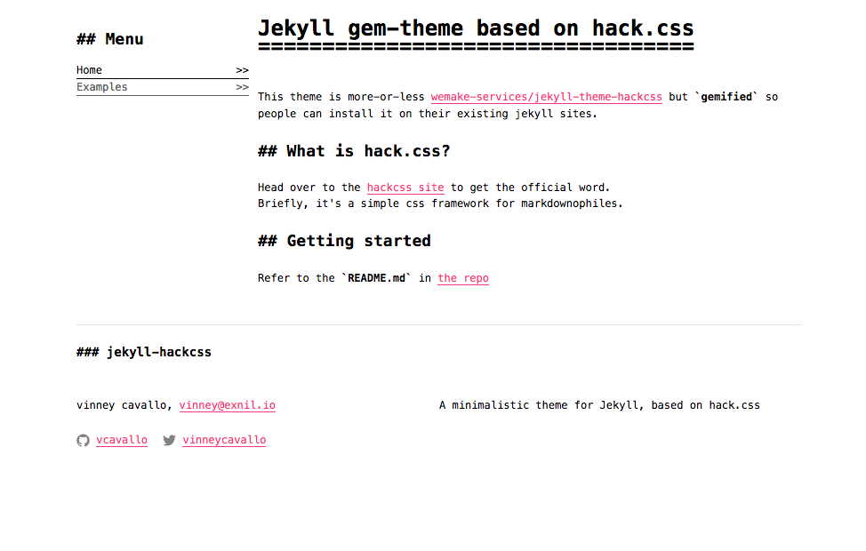

**This theme is a work-in-progress (and incidentally my first jekyll theme).
It does _work_ - but it's also _in progress_** :)

Check out the 'todo' section below to get an idea of what might be missing or under construction. And feel free to contribute!

## Installation

Add this line to your Jekyll site's `Gemfile`:

```ruby
gem "jekyll-hackcss"
```

Add this line to your Jekyll site's `_config.yml`:

```yaml
theme: jekyll-hackcss
```

And then execute:

    $ bundle

Or install it yourself as:

    $ gem install hackcss

Continue reading the _Usage_ section below before expecting this to work perfectly.

## Usage

if you're running a fresh jekyll install, change the `layout` in `index.md` from `home` to `default` (this is the  default name of the ...default layout..) and then start adding some markdown to `index.md` to see what this theme looks like.

There are some rather important bits in `config.yml` that you'll need.  
Refer to this excerpted, commented version to see what these settings do:

```yml
# choose the theme mode you want to use:
theme_mode: markdown  # choices are: 'dark', 'standard', 'markdown', 'markdown_large'
# 'markdown_large' is unique to this project. it's basically the "standard" style
# sizings, but keeping the "markdown" style font. It's my favorite :)

# pretty necessary for the footer (unless removed)
your_name: vinney cavallo
email: vinney@exnil.io

# this is how the menu panel is constructed:
navigation:
  - text: Home
    url: /
  - text: Examples
    url: /examples

# if you want to use something like the card-based 'projects' in examples.html
projects:
  - name: jekyll-hackcss
    description: A jekyll gem-style theme based on hack.css
    link: https://github.com/vcavallo/jekyll-hackcss
  - name: Impostor Roster
    description: A place for newbies of all experience level to admit their shortcomings
    link: http://impostorroster.com
  - name: Rate my Refactor
    description: Advice and discussion about code design and refactoring, crowd-sourced from a community of experts in your field
    link: http://www.ratemyrefactor.com/
  - name: Termodoro
    description: A simple CLI pomodoro client ruby gem
    link: https://github.com/vcavallo/termodoro

# if you plan to use the social links in the footer
social:
  - service: github
    username: vcavallo
    link: https://github.com/vcavallo
  - service: twitter
    username: vinneycavallo
    link: https://twitter.com/vinneycavallo
```

## TODO:

- get `jekyll-seo-tag` working
- modernize! I think the original work in this repo was done for an earlier version of jekyll?
- remove all traces of former theme
- stop using hackss from cdn. include it here.
  - this might mean considering upgrade paths for future hack versions...

## Contributing

Bug reports and pull requests are welcome on GitHub at https://github.com/[USERNAME]/hello. This project is intended to be a safe, welcoming space for collaboration, and contributors are expected to adhere to the [Contributor Covenant](http://contributor-covenant.org) code of conduct.

## License

The theme is available as open source under the terms of the [MIT License](https://opensource.org/licenses/MIT).

